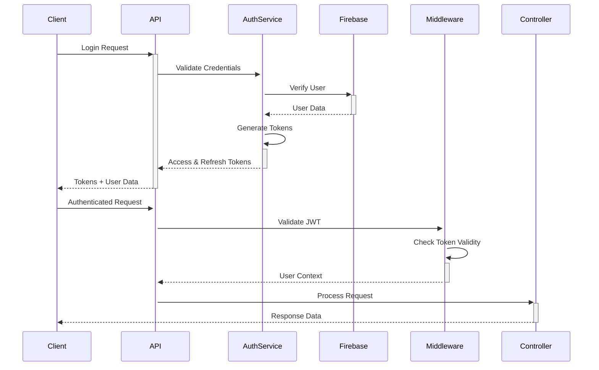

# 🤖 **AI Planner Backend API - Complete Documentation**

## 📋 **Table of Contents**
- [Overview](#overview)
- [Features](#features)
- [Architecture](#architecture)
- [Technology Stack](#technology-stack)
- [Project Structure](#project-structure)
- [Getting Started](#getting-started)
- [Development Setup](#development-setup)
- [API Documentation](#api-documentation)
- [Authentication & Security](#authentication--security)
- [Database Schema](#database-schema)
- [Deployment](#deployment)
- [Monitoring & Logging](#monitoring--logging)
- [Testing](#testing)
- [Performance Optimization](#performance-optimization)
- [Troubleshooting](#troubleshooting)
- [Contributing](#contributing)

## 🎯 **Overview**

The **AI Planner Backend API** is a production-ready, scalable Node.js/TypeScript application that serves as the backend for an intelligent planning and productivity platform. It provides comprehensive planning capabilities with AI-powered features, real-time collaboration, and enterprise-grade security.

### **Core Purpose**
- **Smart Planning**: AI-assisted task planning and scheduling
- **Collaboration**: Real-time multi-user planning sessions
- **Productivity**: Advanced task management with automation
- **Integration**: Calendar sync and external service integrations
- **Analytics**: Usage tracking and productivity insights

## ✨ **Features**

### **Core Functionality**
- 🔐 **Authentication & Authorization**
  - JWT-based authentication with refresh tokens
  - Multi-factor authentication support
  - Role-based access control (RBAC)
  - Account lockout and security features

- 📅 **Planning Management**
  - Create, update, delete planners
  - Section-based organization
  - Activity and task management
  - Drag-and-drop functionality

- 🤖 **AI Integration**
  - AI-powered task suggestions
  - Smart scheduling optimization
  - Productivity insights
  - Automated planning assistance

- 🔄 **Real-time Features**
  - WebSocket support for live collaboration
  - Real-time notifications
  - Live updates across devices

- 📊 **Export & Import**
  - PDF export functionality
  - Handwriting recognition
  - Calendar integration (Google, Outlook)
  - Data backup and restore

### **Enterprise Features**
- 📈 **Monitoring & Analytics**
  - Prometheus metrics
  - Grafana dashboards
  - Application performance monitoring
  - User activity tracking

- 🔒 **Security**
  - Rate limiting and DDoS protection
  - Input validation and sanitization
  - SQL injection prevention
  - XSS protection
  - Security headers

- 🚀 **Performance**
  - Redis caching layer
  - Database query optimization
  - CDN integration
  - Load balancing support

## 🏗️ **Architecture**

### **Design Pattern**: **Domain-Driven Design (DDD) + Clean Architecture**
```
┌─────────────────────────────────────────────────────────────┐
│                        API Layer                           │
│  Controllers → Validation → DTOs → Response Formatting    │
├─────────────────────────────────────────────────────────────┤
│                      Business Logic                        │
│  Services → Business Rules → Domain Models               │
├─────────────────────────────────────────────────────────────┤
│                      Data Access                           │
│  Repositories → ORM/ODM → Database Queries               │
├─────────────────────────────────────────────────────────────┤
│                    Infrastructure                          │
│  External APIs → Caching → File Storage → Message Queues │
└─────────────────────────────────────────────────────────────┘
```

### **Key Architectural Principles**
- **Separation of Concerns**: Each module has clear responsibilities
- **Dependency Inversion**: Dependencies flow inward
- **Interface Segregation**: Small, focused interfaces
- **Single Responsibility**: Each class/function has one purpose
- **Open/Closed**: Extensible without modification

## 🛠️ **Technology Stack**

### **Core Technologies**
| Technology | Version | Purpose |
|------------|---------|---------|
| **Node.js** | 20.x+ | Runtime environment |
| **TypeScript** | 5.x+ | Type-safe development |
| **Express.js** | 4.x+ | Web framework |
| **Firebase Admin** | 12.x+ | Authentication & Database |
| **Redis** | 7.x+ | Caching & Session storage |

### **Security & Validation**
| Package | Version | Purpose |
|---------|---------|---------|
| **bcryptjs** | 2.4.3+ | Password hashing |
| **jsonwebtoken** | 9.x+ | JWT token management |
| **helmet** | 7.x+ | Security headers |
| **express-validator** | 7.x+ | Input validation |
| **express-rate-limit** | 7.x+ | Rate limiting |

### **Monitoring & Logging**
| Package | Version | Purpose |
|---------|---------|---------|
| **Winston** | 3.x+ | Logging framework |
| **Prometheus** | Latest | Metrics collection |
| **Grafana** | Latest | Visualization |
| **@godaddy/terminus** | 4.x+ | Health checks |

### **Development Tools**
| Tool | Version | Purpose |
|------|---------|---------|
| **Jest** | 29.x+ | Testing framework |
| **ESLint** | 8.x+ | Code linting |
| **Prettier** | 3.x+ | Code formatting |
| **Husky** | 9.x+ | Git hooks |
| **PM2** | 5.x+ | Process management |

## 📁 **Project Structure**
Let me analyze the repository structure in detail first to understand what we're working with, then I'll provide the complete file architecture that should be implemented.Based on my analysis of the repository structure and your requirements, here's the **complete file architecture** that should be implemented for a production-ready AI Planner API:

# 🏗️ **Complete File Architecture for AI Planner API**

## **Root Level**
```
ai-planner-api/
├── .env.example                    # Environment variables template
├── .env.production                 # Production environment variables
├── .env.development                # Development environment variables
├── .env.test                       # Test environment variables
├── .gitignore                      # Git ignore rules
├── .eslintrc.js                    # ESLint configuration
├── .prettierrc                     # Prettier configuration
├── tsconfig.json                   # TypeScript configuration
├── nodemon.json                    # Nodemon configuration
├── jest.config.js                  # Jest testing configuration
├── jest.e2e.config.js              # E2E testing configuration
├── ecosystem.config.js             # PM2 configuration
├── package.json                    # NPM dependencies and scripts
├── README.md                       # Project documentation
└── LICENSE                         # License file
```

## **Source Code Structure**

### **Main Application**
```
src/
├── app.ts                          # Express app setup
├── server.ts                       # Server initialization
```

### **Modules (Feature-Based Architecture)**
```
src/modules/
├── auth/                           # Authentication module
│   ├── auth.controller.ts          # Request handlers
│   ├── auth.service.ts             # Business logic
│   ├── auth.repository.ts          # Data access layer
│   ├── auth.types.ts               # TypeScript interfaces/types
│   ├── auth.validation.ts          # Input validation rules
│   ├── auth.middleware.ts          # Auth-specific middleware
│   └── dto/                        # Data Transfer Objects
│       ├── login.dto.ts
│       ├── register.dto.ts
│       ├── token.dto.ts
│       ├── forgot-password.dto.ts
│       ├── reset-password.dto.ts
│       └── update-profile.dto.ts
│
├── planner/                        # Planner module
│   ├── planner.controller.ts
│   ├── planner.service.ts
│   ├── planner.repository.ts
│   ├── planner.types.ts
│   ├── planner.validation.ts
│   └── dto/
│       ├── create-planner.dto.ts
│       ├── update-planner.dto.ts
│       ├── planner-response.dto.ts
│       └── planner-filter.dto.ts
│
├── section/                        # Section module
│   ├── section.controller.ts
│   ├── section.service.ts
│   ├── section.repository.ts
│   ├── section.types.ts
│   └── dto/
│       ├── create-section.dto.ts
│       ├── update-section.dto.ts
│       └── section-response.dto.ts
│
├── activity/                       # Activity module
│   ├── activity.controller.ts
│   ├── activity.service.ts
│   ├── activity.repository.ts
│   ├── activity.types.ts
│   └── dto/
│       ├── create-activity.dto.ts
│       ├── update-activity.dto.ts
│       └── activity-response.dto.ts
│
├── ai/                             # AI integration module
│   ├── ai.controller.ts
│   ├── ai.service.ts
│   ├── ai.repository.ts
│   ├── ai.types.ts
│   └── dto/
│       ├── ai-request.dto.ts
│       └── ai-response.dto.ts
│
├── export/                         # Export module
│   ├── export.controller.ts
│   ├── export.service.ts
│   ├── export.types.ts
│   └── dto/
│       └── export-request.dto.ts
│
├── handwriting/                    # Handwriting module
│   ├── handwriting.controller.ts
│   ├── handwriting.service.ts
│   ├── handwriting.types.ts
│   └── dto/
│       ├── handwriting-request.dto.ts
│       └── handwriting-response.dto.ts
│
├── calendar/                       # Calendar integration module
│   ├── calendar.controller.ts
│   ├── calendar.service.ts
│   ├── calendar.repository.ts
│   ├── calendar.types.ts
│   └── dto/
│       ├── sync-calendar.dto.ts
│       └── calendar-event.dto.ts
│
├── admin/                          # Admin module
│   ├── admin.controller.ts
│   ├── admin.service.ts
│   ├── admin.repository.ts
│   ├── admin.types.ts
│   └── dto/
│       ├── user-management.dto.ts
│       └── system-stats.dto.ts
│
├── user/                           # User management module
│   ├── user.controller.ts
│   ├── user.service.ts
│   ├── user.repository.ts
│   ├── user.types.ts
│   └── dto/
│       ├── user-profile.dto.ts
│       └── user-preferences.dto.ts
│
├── health/                         # Health check module
│   ├── health.controller.ts
│   ├── health.service.ts
│   ├── health.types.ts
│   └── dto/
│       └── health-status.dto.ts
│
├── external/                       # External integrations
│   ├── external.controller.ts
│   ├── external.service.ts
│   ├── external.types.ts
│   └── dto/
│       ├── webhook.dto.ts
│       └── external-api.dto.ts
│
└── shared/                         # Shared module utilities
    ├── shared.controller.ts
    ├── shared.service.ts
    └── shared.repository.ts
```

### **Shared Layer**
```
src/shared/
├── config/                         # Configuration
│   ├── index.ts                    # Main config export
│   ├── database.config.ts          # Database configuration
│   ├── firebase.config.ts          # Firebase configuration
│   ├── redis.config.ts             # Redis configuration
│   ├── security.config.ts          # Security settings
│   ├── swagger.config.ts           # API documentation config
│   ├── email.config.ts             # Email service config
│   └── monitoring.config.ts        # Monitoring config
│
├── middleware/                     # Global middleware
│   ├── auth.middleware.ts          # Authentication middleware
│   ├── validation.middleware.ts    # Request validation
│   ├── error.middleware.ts         # Error handling
│   ├── rate-limit.middleware.ts    # Rate limiting
│   ├── security.middleware.ts      # Security headers
│   ├── logging.middleware.ts       # Request logging
│   ├── circuit-breaker.middleware.ts # Circuit breaker
│   ├── cors.middleware.ts          # CORS handling
│   ├── compression.middleware.ts   # Response compression
│   └── request-id.middleware.ts    # Request tracking
│
├── utils/                          # Utility functions
│   ├── logger.ts                   # Winston logger setup
│   ├── errors.ts                   # Error classes and codes
│   ├── validators.ts               # Validation helpers
│   ├── crypto.ts                   # Encryption utilities
│   ├── rate-limiter.ts             # Rate limiting logic
│   ├── cache.ts                    # Cache utilities
│   ├── pagination.ts               # Pagination helpers
│   ├── sanitization.ts             # Data sanitization
│   ├── async-handler.ts            # Async error handling
│   ├── graceful-shutdown.ts        # Cleanup utilities
│   └── api-response.ts             # Standardized responses
│
├── types/                          # Global TypeScript types
│   ├── index.ts                    # Type exports
│   ├── auth.types.ts               # Auth-related types
│   ├── common.types.ts             # Common interfaces
│   ├── error.types.ts              # Error type definitions
│   ├── api-response.types.ts       # API response types
│   └── database.types.ts           # Database types
│
├── repository/                     # Base repositories
│   ├── base.repository.ts          # Abstract base repository
│   ├── firebase.repository.ts      # Firebase base repository
│   └── cache.repository.ts         # Cache base repository
│
└── services/                       # Shared services
    ├── cache.service.ts            # Redis cache service
    ├── email.service.ts            # Email service
    ├── firebase.service.ts         # Firebase service
    ├── queue.service.ts            # Bull queue service
    ├── notification.service.ts     # Notification service
    ├── file-upload.service.ts      # File handling service
    └── audit.service.ts            # Audit logging service
```

### **Infrastructure Layer**
```
src/infrastructure/
├── database/                       # Database connections
│   ├── firebase.ts                 # Firebase connection
│   ├── redis.ts                    # Redis connection
│   └── mongoose.ts                 # MongoDB connection (if needed)
│
├── queue/                          # Queue setup
│   ├── bullmq.ts                   # BullMQ configuration
│   └── job-processors.ts           # Job processors
│
├── monitoring/                     # Monitoring & observability
│   ├── prometheus.ts               # Metrics collection
│   ├── health-check.ts             # Health check logic
│   ├── metrics.ts                  # Custom metrics
│   └── tracing.ts                  # Distributed tracing
│
└── external/                       # External service configs
    ├── axios-config.ts             # HTTP client config
    └── api-clients.ts              # External API clients
```

## **Testing Structure**
```
tests/
├── setup.ts                        # Test setup and teardown
├── teardown.ts                     # Test cleanup
│
├── unit/                           # Unit tests
│   ├── modules/
│   │   ├── auth/
│   │   ├── planner/
│   │   └── ...
│   └── shared/
│       ├── utils/
│       └── services/
│
├── integration/                    # Integration tests
│   ├── api/
│   │   ├── auth.test.ts
│   │   ├── planner.test.ts
│   │   └── ...
│   └── database/
│       ├── firebase.test.ts
│       └── redis.test.ts
│
├── e2e/                           # End-to-end tests
│   ├── auth.e2e.test.ts
│   ├── planner.e2e.test.ts
│   └── ...
│
├── performance/                    # Performance tests
│   ├── load-tests/
│   └── stress-tests/
│
├── security/                       # Security tests
│   ├── auth.security.test.ts
│   ├── injection.tests.ts
│   └── ...
│
└── utils/                          # Test utilities
    ├── test-helpers.ts
    ├── mock-data.ts
    └── test-database.ts
```

## **Documentation**
```
docs/
├── api/                           # API documentation
│   ├── endpoints.md
│   ├── authentication.md
│   └── examples/
│
├── swagger/                       # Swagger/OpenAPI
│   ├── openapi.json
│   └── swagger-config.ts
│
├── architecture/                  # Architecture docs
│   ├── overview.md
│   ├── database-schema.md
│   └── flow-diagrams/
│
└── deployment/                    # Deployment guides
    ├── docker.md
    ├── kubernetes.md
    └── ci-cd.md
```

## **DevOps & Deployment**
```
scripts/
├── setup.sh                       # Initial setup script
├── deploy.sh                      # Deployment script
├── backup.sh                      # Database backup
├── migrate.sh                     # Database migration
├── health-check.sh                # Health check script
└── cleanup.sh                     # Cleanup script

docker/
├── Dockerfile                     # Main Dockerfile
├── docker-compose.yml             # Development compose
├── docker-compose.prod.yml        # Production compose
├── docker-compose.test.yml        # Testing compose
└── .dockerignore                  # Docker ignore file

nginx/
├── nginx.conf                     # Nginx configuration
├── ssl/                           # SSL certificates
└── sites-available/               # Site configurations

monitoring/
├── prometheus.yml                 # Prometheus config
├── grafana/                       # Grafana dashboards
│   ├── dashboards/
│   └── provisioning/
└── alerts/                        # Alert rules
```


## 🚀 **Getting Started**

### **Prerequisites**
- **Node.js** >= 20.0.0
- **npm** >= 10.0.0
- **Redis** >= 7.0
- **Firebase Project** with Firestore Database

### **Environment Setup**

1. **Clone the Repository**
```bash
git clone https://github.com/ayy-oub/ai-planner-api.git
cd ai-planner-api
```

2. **Install Dependencies**
```bash
npm install
```

3. **Environment Configuration**
```bash
# Copy environment template
cp .env.example .env.development

# Edit the file with your configurations
nano .env.development
```

### **Required Environment Variables**

```bash
# Application
NODE_ENV=development
PORT=5000
API_VERSION=v1
API_PREFIX=/api

# Firebase (Required)
FIREBASE_PROJECT_ID=your-project-id
FIREBASE_CLIENT_EMAIL=your-client-email
FIREBASE_PRIVATE_KEY=your-private-key
FIREBASE_DATABASE_URL=https://your-project.firebaseio.com
FIREBASE_STORAGE_BUCKET=your-project.appspot.com

# Redis (Required)
REDIS_HOST=localhost
REDIS_PORT=6379
REDIS_PASSWORD=your-redis-password

# Security (Required)
JWT_SECRET=your-super-secure-jwt-secret-min-256-bits
SESSION_SECRET=your-session-secret-min-256-bits
API_KEY_SECRET=your-api-key-secret

# Email (Optional)
SMTP_HOST=smtp.gmail.com
SMTP_PORT=587
SMTP_USER=your-email@gmail.com
SMTP_PASS=your-app-password

# Monitoring
METRICS_ENABLED=true
GRAFANA_PASSWORD=your-grafana-password
```

## 💻 **Development Setup**

### **Development Mode**
```bash
# Start development server with hot reload
npm run dev

# Server will start at http://localhost:5000
# API documentation at http://localhost:5000/api-docs
```

### **Available Scripts**
```bash
# Development
npm run dev                    # Start development server
npm run build                  # Build for production
npm start                      # Start production server

# Testing
npm test                       # Run all tests
npm run test:unit             # Unit tests only
npm run test:integration      # Integration tests only
npm run test:e2e              # End-to-end tests
npm run test:coverage         # Generate coverage report
npm run test:watch            # Watch mode

# Code Quality
npm run lint                  # Lint code
npm run lint:fix              # Fix linting issues
npm run format                # Format code
npm run typecheck             # TypeScript type checking

# Security
npm run security:audit        # Audit dependencies
npm run security:check        # Run security checks

# Documentation
npm run docs                  # Generate API documentation
npm run docs:serve            # Serve documentation

# Docker
npm run docker:build          # Build Docker image
npm run docker:run            # Run Docker container
npm run docker:compose        # Start with Docker Compose

# PM2
npm run pm2:start             # Start with PM2
npm run pm2:stop              # Stop PM2 processes
npm run pm2:restart           # Restart PM2 processes
npm run pm2:logs              # View PM2 logs
```

## 📚 **API Documentation**

### **Base URL**
```
http://localhost:5000/api/v1
```

### **Authentication Endpoints**
| Method | Endpoint | Description |
|--------|----------|-------------|
| POST | `/auth/register` | Register new user |
| POST | `/auth/login` | User login |
| POST | `/auth/refresh` | Refresh access token |
| POST | `/auth/logout` | User logout |
| GET | `/auth/me` | Get user profile |
| PATCH | `/auth/update-profile` | Update profile |
| POST | `/auth/change-password` | Change password |
| POST | `/auth/forgot-password` | Request password reset |
| POST | `/auth/reset-password` | Reset password |
| POST | `/auth/verify-email` | Verify email |
| POST | `/auth/resend-verification` | Resend verification email |

### **Planner Endpoints**
| Method | Endpoint | Description |
|--------|----------|-------------|
| GET | `/planners` | Get all planners |
| POST | `/planners` | Create new planner |
| GET | `/planners/:id` | Get planner by ID |
| PATCH | `/planners/:id` | Update planner |
| DELETE | `/planners/:id` | Delete planner |
| POST | `/planners/:id/duplicate` | Duplicate planner |
| POST | `/planners/:id/share` | Share planner |

### **Section Endpoints**
| Method | Endpoint | Description |
|--------|----------|-------------|
| GET | `/planners/:plannerId/sections` | Get sections |
| POST | `/planners/:plannerId/sections` | Create section |
| PATCH | `/sections/:id` | Update section |
| DELETE | `/sections/:id` | Delete section |
| POST | `/sections/:id/reorder` | Reorder section |

### **AI Endpoints**
| Method | Endpoint | Description |
|--------|----------|-------------|
| POST | `/ai/suggest-tasks` | Get AI task suggestions |
| POST | `/ai/optimize-schedule` | Optimize schedule |
| POST | `/ai/analyze-productivity` | Analyze productivity |
| GET | `/ai/insights` | Get AI insights |

### **Export Endpoints**
| Method | Endpoint | Description |
|--------|----------|-------------|
| POST | `/export/pdf` | Export as PDF |
| POST | `/export/calendar` | Export to calendar |
| POST | `/export/handwriting` | Export handwriting |

## 🔐 **Authentication & Security**

### **JWT Authentication Flow**



### **Security Features**
- **Password Security**: Bcrypt hashing with configurable rounds (default: 12)
- **JWT Tokens**: Short-lived access tokens (15 min) + refresh tokens (7 days)
- **Rate Limiting**: IP-based and user-based rate limiting
- **Account Lockout**: Automatic lockout after 5 failed login attempts
- **Email Verification**: Mandatory email verification for new accounts
- **HTTPS Enforcement**: All communications encrypted
- **Security Headers**: Helmet.js for security headers
- **Input Sanitization**: XSS and injection attack prevention
- **CORS Protection**: Configurable CORS policies

### **Rate Limiting**
```javascript
// General API rate limiting
windowMs: 15 minutes
max: 100 requests per IP

// Authentication endpoints
windowMs: 15 minutes
max: 5 requests per IP

// Premium users get higher limits
windowMs: 15 minutes
max: 500 requests per user
```

## 🗄️ **Database Schema**

### **Firebase Firestore Collections**

#### **Users Collection**
```javascript
{
  uid: string,                    // Firebase UID
  email: string,                  // User email
  displayName: string,            // Display name
  photoURL: string,               // Profile photo URL
  emailVerified: boolean,         // Email verification status
  preferences: {
    theme: 'light' | 'dark',
    accentColor: string,
    defaultView: string,
    notifications: boolean,
    language: string
  },
  subscription: {
    plan: 'free' | 'premium' | 'enterprise',
    status: 'active' | 'inactive',
    expiresAt: Timestamp
  },
  statistics: {
    totalPlanners: number,
    totalTasks: number,
    completedTasks: number,
    streakDays: number
  },
  security: {
    failedLoginAttempts: number,
    lockedUntil: Timestamp,
    passwordChangedAt: Timestamp,
    twoFactorEnabled: boolean
  },
  createdAt: Timestamp,
  updatedAt: Timestamp,
  lastLogin: Timestamp
}
```

#### **Planners Collection**
```javascript
{
  id: string,                     // Unique planner ID
  userId: string,                 // Owner user ID
  title: string,                  // Planner title
  description: string,            // Planner description
  color: string,                  // Theme color
  icon: string,                   // Icon identifier
  sections: Section[],            // Array of sections
  settings: {
    isPublic: boolean,
    allowCollaboration: boolean,
    autoArchive: boolean,
    reminderEnabled: boolean
  },
  collaborators: [{               // Shared users
    userId: string,
    role: 'viewer' | 'editor' | 'admin',
    addedAt: Timestamp
  }],
  tags: string[],                 // Planner tags
  metadata: {
    version: number,
    schemaVersion: string
  },
  createdAt: Timestamp,
  updatedAt: Timestamp,
  archivedAt: Timestamp
}
```

#### **Sections Collection**
```javascript
{
  id: string,                     // Unique section ID
  plannerId: string,              // Parent planner ID
  title: string,                  // Section title
  description: string,            // Section description
  order: number,                  // Display order
  type: 'tasks' | 'notes' | 'goals',
  activities: Activity[],         // Array of activities
  settings: {
    collapsed: boolean,
    color: string,
    icon: string
  },
  createdAt: Timestamp,
  updatedAt: Timestamp
}
```

#### **Activities Collection**
```javascript
{
  id: string,                     // Unique activity ID
  sectionId: string,              // Parent section ID
  plannerId: string,              // Parent planner ID
  title: string,                  // Activity title
  description: string,            // Activity description
  type: 'task' | 'event' | 'note' | 'goal',
  status: 'pending' | 'in-progress' | 'completed' | 'cancelled',
  priority: 'low' | 'medium' | 'high' | 'urgent',
  dueDate: Timestamp,             // Due date
  completedAt: Timestamp,         // Completion date
  tags: string[],                 // Activity tags
  attachments: [{                 // File attachments
    id: string,
    name: string,
    url: string,
    type: string,
    size: number
  }],
  aiSuggestions: [{               // AI-generated suggestions
    id: string,
    suggestion: string,
    confidence: number,
    accepted: boolean
  }],
  metadata: {
    estimatedDuration: number,    // Estimated time in minutes
    actualDuration: number,       // Actual time spent
    difficulty: number,           // 1-5 scale
    energyLevel: number           // 1-5 scale
  },
  createdAt: Timestamp,
  updatedAt: Timestamp
}
```

## 🚀 **Deployment**

### **Docker Deployment**

1. **Build Docker Image**
```bash
# Build the Docker image
docker build -t ai-planner-api:latest -f docker/Dockerfile .

# Or use the npm script
npm run docker:build
```

2. **Docker Compose (Recommended)**
```bash
# Start all services
docker-compose -f docker/docker-compose.yml up -d

# Production deployment
docker-compose -f docker/docker-compose.prod.yml up -d

# View logs
docker-compose logs -f app
```

### **Production Deployment Checklist**
- [ ] Set `NODE_ENV=production`
- [ ] Configure SSL certificates
- [ ] Set strong JWT secrets
- [ ] Configure rate limiting
- [ ] Set up monitoring alerts
- [ ] Configure backup strategy
- [ ] Set up CI/CD pipeline
- [ ] Configure log rotation
- [ ] Set up error tracking
- [ ] Performance testing completed

### **PM2 Deployment**
```bash
# Install PM2 globally
npm install -g pm2

# Start application with PM2
pm2 start ecosystem.config.js --env production

# Save PM2 configuration
pm2 save

# Setup PM2 to start on system boot
pm2 startup

# Monitor application
pm2 monit

# View logs
pm2 logs ai-planner-api
```

### **Environment-Specific Configurations**

#### **Development**
```javascript
// ecosystem.config.js
env_development: {
  NODE_ENV: 'development',
  PORT: 5000,
  LOG_LEVEL: 'debug',
  ENABLE_SWAGGER: true,
  METRICS_ENABLED: false
}
```

#### **Production**
```javascript
// ecosystem.config.js
env_production: {
  NODE_ENV: 'production',
  PORT: 5000,
  LOG_LEVEL: 'info',
  ENABLE_SWAGGER: false,
  METRICS_ENABLED: true,
  COOKIE_SECURE: true,
  COOKIE_HTTP_ONLY: true
}
```

### **Kubernetes Deployment**
```yaml
# k8s/deployment.yaml
apiVersion: apps/v1
kind: Deployment
metadata:
  name: ai-planner-api
spec:
  replicas: 3
  selector:
    matchLabels:
      app: ai-planner-api
  template:
    metadata:
      labels:
        app: ai-planner-api
    spec:
      containers:
      - name: ai-planner-api
        image: ai-planner-api:latest
        ports:
        - containerPort: 5000
        env:
        - name: NODE_ENV
          value: "production"
        resources:
          requests:
            memory: "256Mi"
            cpu: "250m"
          limits:
            memory: "512Mi"
            cpu: "500m"
```

## 📊 **Monitoring & Logging**

### **Prometheus Metrics**
```bash
# Application metrics available at
http://localhost:5000/metrics

# Prometheus configuration
# monitoring/prometheus.yml
global:
  scrape_interval: 15s

scrape_configs:
  - job_name: 'ai-planner-api'
    static_configs:
      - targets: ['localhost:5000']
```

### **Grafana Dashboards**
Access Grafana at `http://localhost:3000`
- **Default credentials**: admin / your-grafana-password
- **Pre-configured dashboards**:
  - API Performance Dashboard
  - Error Rate Dashboard
  - User Activity Dashboard
  - System Health Dashboard

### **Log Management**
```bash
# Application logs
logs/application-YYYY-MM-DD.log

# Error logs
logs/error-YYYY-MM-DD.log

# PM2 logs
logs/pm2.log

# Nginx logs
logs/nginx/access.log
logs/nginx/error.log
```

### **Health Checks**
```bash
# Application health
GET http://localhost:5000/health

# Detailed health with dependencies
GET http://localhost:5000/health/detailed

# Readiness check
GET http://localhost:5000/health/ready

# Liveness check
GET http://localhost:5000/health/live
```

### **Alerting Rules**
```yaml
# monitoring/alerts.yml
groups:
  - name: ai-planner-api
    rules:
      - alert: HighErrorRate
        expr: rate(http_requests_total{status=~"5.."}[5m]) > 0.1
        for: 5m
        annotations:
          summary: "High error rate detected"
          
      - alert: HighResponseTime
        expr: histogram_quantile(0.95, rate(http_request_duration_seconds_bucket[5m])) > 1
        for: 5m
        annotations:
          summary: "High response time detected"
```

## 🧪 **Testing**

### **Test Structure**
```bash
# Run all tests
npm test

# Run specific test suites
npm run test:unit           # Unit tests
npm run test:integration    # Integration tests
npm run test:e2e           # End-to-end tests
npm run test:performance   # Performance tests
npm run test:security      # Security tests

# Generate coverage report
npm run test:coverage

# Watch mode for development
npm run test:watch
```

### **Test Coverage Requirements**
- **Statements**: 80%
- **Branches**: 80%
- **Functions**: 80%
- **Lines**: 80%

### **Performance Testing**
```bash
# Load testing with autocannon
npm install -g autocannon
autocannon -c 100 -d 30 http://localhost:5000/api/v1/health

# Stress testing
autocannon -c 1000 -d 60 http://localhost:5000/api/v1/planners
```

### **Security Testing**
```bash
# Dependency audit
npm audit

# Security scan with Snyk
npm run security:check

# OWASP ZAP scanning
# Configure ZAP to scan http://localhost:5000
```

## ⚡ **Performance Optimization**

### **Caching Strategy**
```javascript
// Redis caching layers
1. User session cache (15 minutes)
2. API response cache (configurable TTL)
3. Database query cache (5 minutes)
4. Static asset cache (24 hours)
```

### **Database Optimization**
- **Indexing**: Compound indexes on frequently queried fields
- **Query optimization**: Projection and limit usage
- **Connection pooling**: Efficient connection management
- **Batch operations**: Bulk read/write operations

### **API Optimization**
- **Pagination**: Cursor-based pagination for large datasets
- **Field selection**: Allow clients to specify required fields
- **Compression**: Gzip compression for responses
- **HTTP/2**: Support for multiplexing

### **Frontend Optimization**
- **CDN integration**: Static asset serving
- **Image optimization**: Automatic resizing and WebP conversion
- **Lazy loading**: On-demand resource loading
- **Prefetching**: Predictive resource loading

## 🔧 **Troubleshooting**

### **Common Issues**

#### **Port Already in Use**
```bash
# Find process using port 5000
lsof -i :5000

# Kill the process
kill -9 <PID>
```

#### **Database Connection Issues**
```bash
# Check Redis connection
redis-cli ping

# Check Firebase credentials
node -e "console.log(require('firebase-admin').credential)"

# Test database connectivity
npm run test:integration
```

#### **High Memory Usage**
```bash
# Monitor memory usage
pm2 monit

# Check for memory leaks
node --inspect src/server.js
# Open chrome://inspect in Chrome
```

#### **Performance Issues**
```bash
# Enable debug logging
DEBUG=* npm run dev

# Profile application
node --prof src/server.js
node --prof-process isolate-*.log > profile.txt
```

### **Log Analysis**
```bash
# View recent errors
tail -f logs/error-$(date +%Y-%m-%d).log

# Search for specific errors
grep "ERROR" logs/application-$(date +%Y-%m-%d).log

# Monitor real-time logs
pm2 logs --lines 50
```

### **Recovery Procedures**

#### **Database Recovery**
```bash
# Restore from backup
npm run restore:database -- --backup-file=backup-YYYY-MM-DD.firestore

# Reset user passwords
npm run admin:reset-password -- --email=user@example.com
```

#### **Application Recovery**
```bash
# Restart all services
pm2 restart all

# Clear cache
redis-cli FLUSHALL

# Reset PM2
pm2 kill && pm2 start ecosystem.config.js
```

## 🤝 **Contributing**

### **Development Workflow**
1. **Fork** the repository
2. **Create** a feature branch (`git checkout -b feature/amazing-feature`)
3. **Commit** your changes (`git commit -m 'Add amazing feature'`)
4. **Push** to the branch (`git push origin feature/amazing-feature`)
5. **Open** a Pull Request

### **Code Standards**
- **ESLint**: Follow the project's linting rules
- **Prettier**: Use automatic code formatting
- **TypeScript**: Strict mode enabled
- **Testing**: Maintain 80% code coverage
- **Documentation**: Update docs for new features

### **Commit Message Convention**
```
<type>(<scope>): <subject>

<body>

<footer>
```

**Types**: `feat`, `fix`, `docs`, `style`, `refactor`, `test`, `chore`

### **Pull Request Template**
```markdown
## Description
Brief description of changes

## Type of Change
- [ ] Bug fix
- [ ] New feature
- [ ] Breaking change
- [ ] Documentation update

## Testing
- [ ] Unit tests pass
- [ ] Integration tests pass
- [ ] Manual testing completed

## Checklist
- [ ] Code follows project style guidelines
- [ ] Self-review completed
- [ ] Documentation updated
- [ ] Tests added/updated
```

## 📞 **Support**

### **Contact Information**
- **Email**: support@aiplanner.com
- **Documentation**: https://docs.aiplanner.com
- **API Status**: https://status.aiplanner.com
- **Bug Reports**: https://github.com/ayy-oub/ai-planner-api/issues

### **Community**
- **Discord**: https://discord.gg/aiplanner
- **Forum**: https://community.aiplanner.com
- **Stack Overflow**: Tag with `ai-planner-api`

---

## 📄 **License**

This project is licensed under the MIT License - see the [LICENSE](LICENSE) file for details.

---

**⭐ Star this repository if you find it helpful!**

**🚀 Happy Planning with AI!**